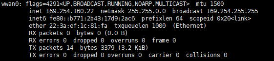
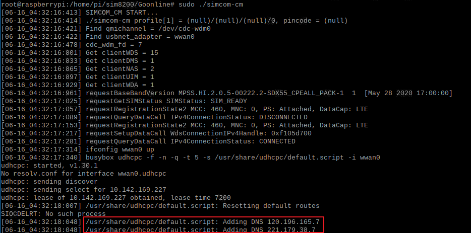

# 5G-IIoT
This project is about the 5G IIoT Smart Terminal built with the Raspberry Pi and the integrated 5G IoT Modules. The smart terminal is capable of dealing with the variety of IoT scenarios such as video processing, data acquisition and even software defined PLC that need the enhanced radio link capabilities from 5G. Further, it is to be built as the service node in the system supporting the automating deployment, scaling, and management of containerized applications such as Kubernetes.


 The IoT devices with the 5G modules is able to connect to the cutting edge of 5G cellular networks setup by the telecom operator or even the enterprise itself which is known as local 5G or private 5G. The ultra-high data rates and ultra-low latency offered by 5G enables the applications as diverse as remote surgery, autonomous driving, virtual reality gaming, AI-driven smart manufacturing and robotics.

----------
## Description
 The project is divided into several phases:

- **Phase I**: To build the Raspberry Pi device integrated with the 5G IoT Modules enabling the radio communication with the 5G network.

- **Phase II**: To setup the service components in the Phase-I device enabling some use cases such as the remote data acquisition by the RS485 serial port and the remote access of PLC through the 5G network etc.

- **Phase III**: To integrate the Phase-I device into the Kubernetes system wherein the components developed in Phase-II can be managed in the way as if they are running in the work nodes of traditional Kubernetes.  


## Getting Started
### Dependencies

- Hardware: (1) CM4 8G + 32G eMMC, (2) SIM8200EA-M2
- Software: (1) raspios_arm64-2021-11-08, (2) SIM8200_for_RPI

### Installing


- To install the driver of 5G module (SIM8200EA-M2)

```
sudo chmod 777 -R SIM8200_for_RPI
cd SIM8200_for_RPI
sudo ./install.sh
```

- To check whether the 5G module works. If so, the information about WWAN0 is displayed.

```
ifconfig -a
```




- To test the AT command.

```
sudo apt-get install minicom
sudo minicom -D /dev/ttyUSB2
```


- To check whether the 5G network connection work. If so, the information about DNS query is displayed.

```
cd Goonline
make
sudo ./simcom-cm &
```



- To renew the 5G connection given it fails in accessing the network.

```
sudo dhclient -v wwan0
sudo route add -net 0.0.0.0 wwan0
```

- To enable the automatic execution of the 5G connection procedure after the CM4 restarts. Firstly, the rc.local script should be edited.

```
sudo nano /etc/rc.local
```

Then the following codes are added to the second line from the bottom of the rc.local script.

```
sudo /home/pi/SIM8200_for_RPI/Goonline/simcom-cm &
```

## Authors
1. Yifan Yu, yuyifan@ailinking.com
2. Jiangping Feng, fengjiangping@ailinking.com
3. Zhuo Xu, xuzhuo@ailinking.com

## Acknowledgments
- https://www.waveshare.net/
